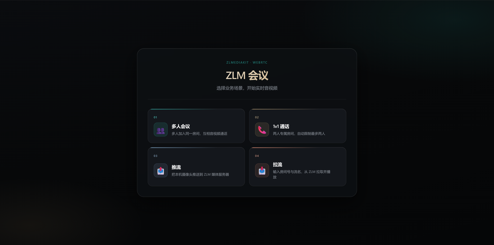
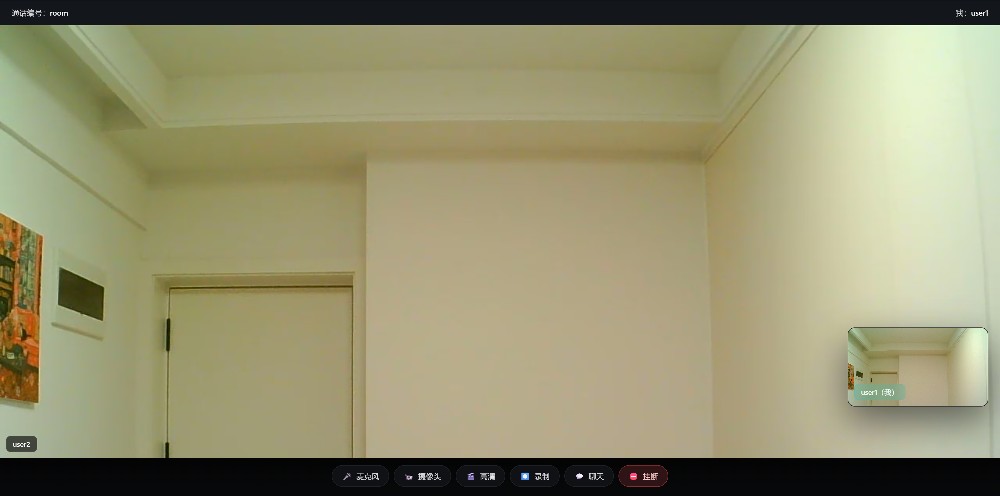
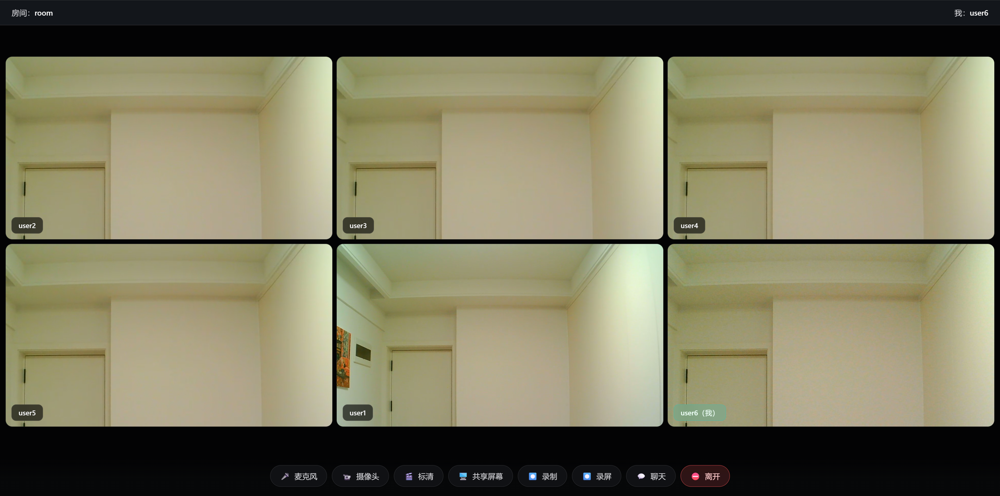
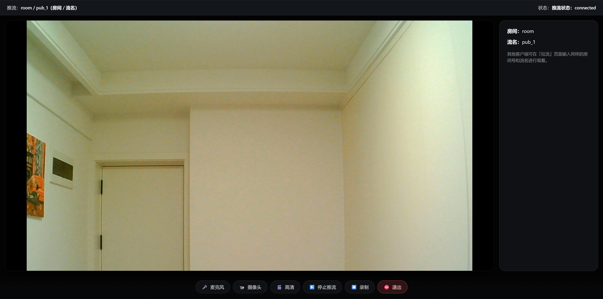
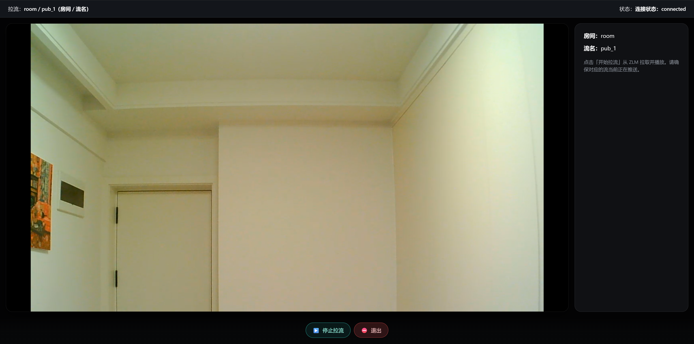

# zlm_meet

[](./LICENSE)
[](https://golang.org/)
[](https://github.com/ZLMediaKit/ZLMediaKit)
[]()
[](https://github.com/ZLMediaKit/ZLMediaKit)

> 一个基于 **ZLMediaKit + Go + WebRTC** 的最小可用多人视频会议示例，内置四种业务入口。

```
浏览器 ──(WebSocket 信令)── Go 后端 ──(HTTP REST)── ZLMediaKit
   │                                                  ▲
   └──────────── WebRTC ICE/SRTP（音视频直连）─────────┘
```

## 一、项目特点

- 依托 ZLMediaKit 作为媒体服务，WebRTC 推拉流开箱即用，无需自行实现 SFU。
- 后端使用 Go + WebSocket 实现信令，代码极简，易于二次开发。
- 前端零构建依赖，纯原生 HTML/JS（ES Module），浏览器直开即用。
- 首页统一入口，支持 **多人会议 / 1v1 通话 / 独立推流 / 独立拉流** 四种业务。
- 每个用户独立推流（`cam` + 可选 `screen`），其他人各自订阅，互不耦合。
- 「房间号」即 ZLM `app`，同房间共享一个流分组；会议/通话流名后端固定为 `user_<userId>_<kind>`，独立推/拉流由用户输入流名。
- 支持麦克风/摄像头热切换、屏幕共享、文字聊天、画质档位切换、MP4 录制与预览下载。
- 会议与 1v1 通话支持**双击窗口切换大小窗布局**（详见 [业务说明](./docs/业务说明.md#五界面布局与窗口切换)）。

## 二、界面预览

| 主页 |
|:---:|
|  |

| 1v1 通话 | 多人会议 |
|:---:|:---:|
|  |  |

| 推流 | 拉流 |
|:---:|:---:|
|  |  |

## 三、如何构建和使用

**前提：已有一个开启了 WebRTC 与 HTTP API 的 ZLMediaKit 实例。** 详细配置见 [docs/配置.md](./docs/配置.md)。

### 1. 编译

需要 Go 1.21+：

```bash
bash backend/scripts/build.sh
```

脚本会初始化 `backend/bin/`、复制配置模板、拉取依赖并编译出 `backend/bin/zlm_meet`。

编辑运行时配置：

```bash
vi backend/bin/conf/config.yaml
```

主要配置项：`listen`（默认 `:8080`）、`tls_cert` / `tls_key`、`static_dir`、`allowed_origins`、`zlm.api_base`、`zlm.secret`。详见 [docs/配置.md](./docs/配置.md)。

### 2. 启动

```bash
bash backend/scripts/start.sh
```

默认监听 `:8080`，打开 `https://信令服务ip:端口/` 即可看到业务选择页。

### 3. 生成 TLS 证书（局域网 HTTPS）

浏览器仅在 `https://` 或 `http://localhost` 下允许获取摄像头。局域网其他设备访问时需先启用 TLS。

`build.sh` 会创建 `backend/bin/cert/` 目录，并在配置中预设：

```yaml
tls_cert: "cert/cert.pem"
tls_key:  "cert/key.pem"
```

进入证书目录并生成自签证书（将 `192.168.1.100` 改为信令服务器局域网 IP）：

```bash
cd backend/bin/cert

openssl req -x509 -newkey rsa:2048 \
  -keyout key.pem -out cert.pem -days 365 -nodes \
  -subj "/CN=192.168.1.100" \
  -addext "subjectAltName=IP:192.168.1.100,DNS:localhost"
```

仅本机调试时，可省略 `-addext`，使用更简短的命令：

```bash
cd backend/bin/cert
openssl req -x509 -newkey rsa:2048 -keyout key.pem -out cert.pem -days 365 -nodes
```

证书生成后重启服务，访问 `https://信令服务ip:端口/`。浏览器提示证书不受信任时，选择「高级 → 继续访问」。

## 四、文档

| 文档 | 说明 |
|------|------|
| [业务说明](./docs/业务说明.md) | 四种业务入口、交互流程、功能清单 |
| [开发参考](./docs/开发参考.md) | 项目结构、信令协议、快速排错 |
| [配置](./docs/配置.md) | ZLMediaKit 与信令服务配置说明 |
| [已知限制](./docs/limitations.md) | 部署与能力边界 |

## 四、授权协议

本项目使用 [MIT](./LICENSE) 协议。
