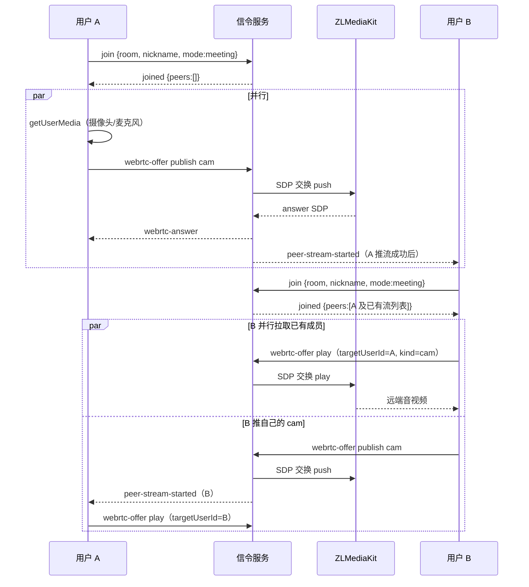
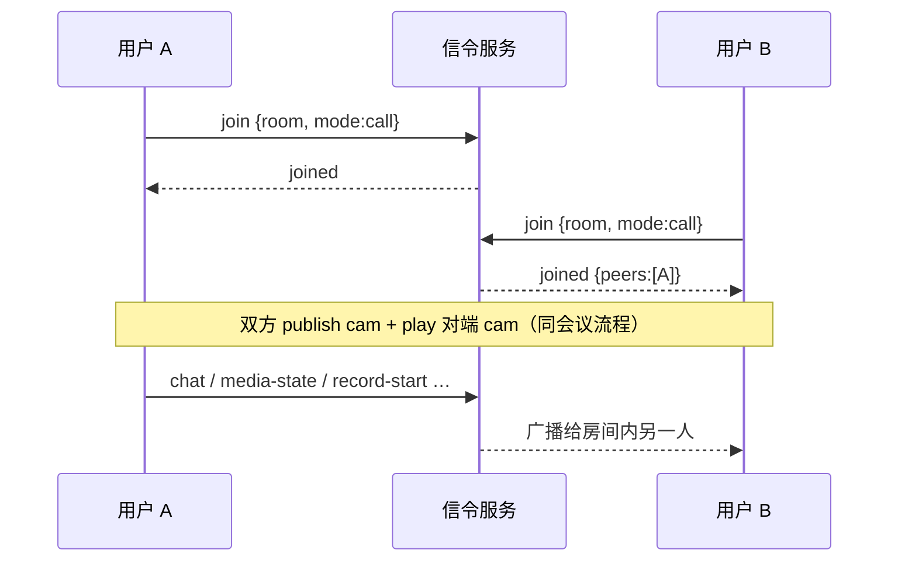
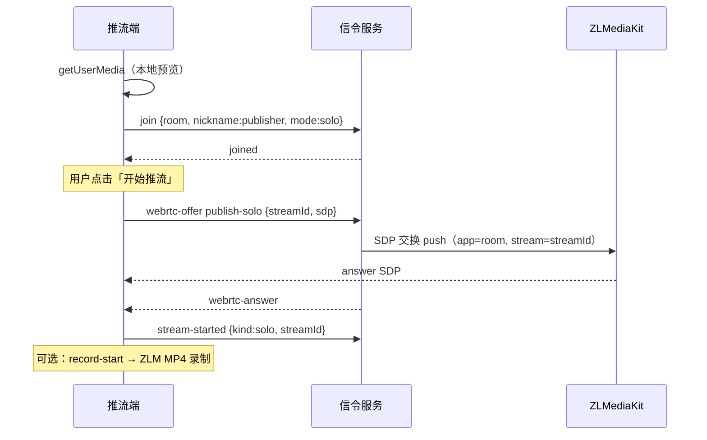
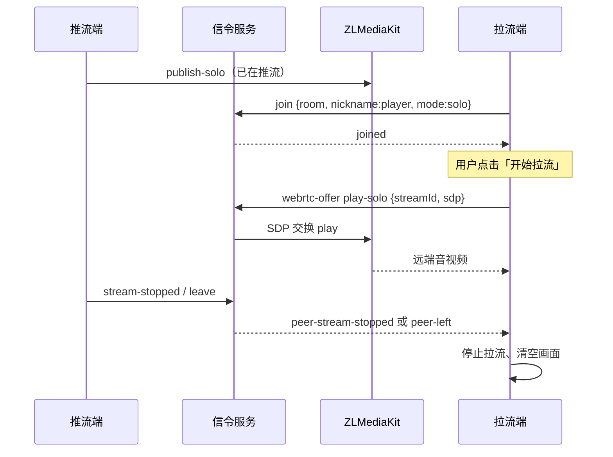

# 业务说明

## 一、项目定位

- 学习 WebRTC + ZLMediaKit 信令交互的最小参考实现。
- 可作为二次开发基础，扩展鉴权、录制、转推等生产特性。

## 二、业务入口

首页（`/`）提供四张业务卡片，填写表单后进入对应页面。支持深链直达：`/?biz=meeting|call|push|play`。

| 业务 | 页面 | 房间模式 | 人数限制 | 说明 |
|------|------|----------|----------|------|
| 多人会议 | `meeting.html` | `meeting` | 无 | 多人音视频、屏幕共享、聊天、录制 |
| 1v1 通话 | `call.html` | `call` | 最多 2 人 | 大画面 + 自视图小窗，功能与会议类似 |
| 推流 | `push.html` | `solo` | 无 | 输入房间号 + 流名，将本机摄像头推到 ZLM |
| 拉流 | `play.html` | `solo` | 无 | 输入房间号 + 流名，从 ZLM 拉流播放 |

### 1. 房间号与流名约定

- 前端「房间号」→ ZLM 的 `app` 字段；同一房间号的用户处于同一 ZLM 流分组。
- 会议/通话：后端自动生成流名 `user_<userId>_cam` / `user_<userId>_screen`。
- 独立推/拉流：用户自定义流名（仅字母数字、`_`、`-`、`.`，最长 128 字符）。

## 三、业务交互流程

以下描述从用户进入页面到媒体连通的完整路径。四种业务均先建立 **WebSocket**（`/ws`），再通过信令驱动 **ZLM WebRTC SDP 交换**；音视频数据不经过 Go 后端，由浏览器与 ZLM 直连。

### 1. 通用步骤

1. 首页填写表单 → 昵称/房间号/流名写入 `sessionStorage` → 跳转业务页
2. 业务页连接 `wss://<信令服务>/ws`（或 `ws://`）
3. 发送 `join`：`room` 映射为 ZLM `app`，`mode` 决定房间语义与人数上限
4. 媒体协商：客户端发 `webrtc-offer`（含 SDP）→ 服务端转发 ZLM `/index/api/webrtc` → 回 `webrtc-answer`
5. 离开：发 `leave` 或断开 WS → 服务端停止录制、关闭该用户关联流

---

### 2. 多人会议（`meeting.html`，`mode=meeting`）

**适用场景**：同一房间号下多人互相看到/听到彼此，支持屏幕共享与聊天。

#### 2.1. 详细流程

| 阶段 | 动作 |
|------|------|
| 入会 | 连接 WS → `join` → 收到 `joined`（含已在房成员及其 `streams`） |
| 本端推流 | `getUserMedia` 与信令**并行**；拿到本地流后 `webrtc-offer`（`mode=publish`，`kind=cam`）→ 流名 `user_<userId>_cam` |
| 拉取他人 | 对 `joined.peers` 中每个已有流发 `webrtc-offer`（`mode=play`）；新成员加入时收到 `peer-joined` 即**预拉**其 cam |
| 屏幕共享 | 用户点「共享屏幕」→ `getDisplayMedia` → `publish`（`kind=screen`）→ 他人收到 `peer-stream-started` 后拉 `screen` |
| 状态同步 | 开关麦克风/摄像头 → `media-state` → 他人收到 `peer-state`；文字 → `chat` 广播（聊天未打开时按钮显示红点） |
| 录制 | `record-start/stop`（`kind=cam\|screen`）→ 服务端调 ZLM 录制 → 停止后 `record-state` 带 `recordFileUrl`，前端预览/下载 |
| 离开 | `leave` → 广播 `peer-stream-stopped` + `peer-left` → 服务端停止录制并 `close_streams` |

---

### 3. 1v1 通话（`call.html`，`mode=call`）

**与多人会议的信令/媒体路径相同**，差异仅在房间策略与 UI：

| 差异点 | 说明 |
|--------|------|
| 人数 | 服务端 `capacity=2`，第三人 `join` 返回错误 |
| 布局 | 大画面显示对端，右下角小窗显示自己（`call-layout`） |
| 功能裁剪 | 隐藏「屏幕共享」按钮；仍支持画质切换、录制、聊天 |
| 流命名 | 与会议相同：`user_<userId>_cam` |

---

### 4. 独立推流（`push.html`，`mode=solo`）

**适用场景**：仅向 ZLM 推送一路流，无需与其他浏览器用户互动；推/拉方可共用同一 `room`（ZLM `app`）。

#### 4.1. 详细流程

| 阶段 | 动作 |
|------|------|
| 准备 | 首页输入**房间号 + 流名** → `push.html` 打开摄像头本地预览 |
| 入会 | `join`（`mode=solo`）；solo 房间**不广播** peer/chat 事件 |
| 推流 | 点击「开始推流」→ `webrtc-offer`（`mode=publish-solo`，携带用户输入的 `streamId`） |
| 停止 | 点击「停止推流」→ `stream-stopped` → 关闭 PeerConnection |
| 录制 | 须先推流；`record-start/stop` 传 `streamId`；停止后可预览/下载 MP4 |
| 离开 | `leave` → 自动停录、关流 |

> 拉流端须使用**相同房间号 + 相同流名**才能播放。

---

### 5. 独立拉流（`play.html`，`mode=solo`）

**适用场景**：从 ZLM 播放指定流，不采集本机摄像头。

#### 5.1. 详细流程

| 阶段 | 动作 |
|------|------|
| 准备 | 首页输入与推流端一致的**房间号 + 流名** |
| 入会 | `join`（`mode=solo`），页面显示「已就绪」 |
| 拉流 | 点击「开始拉流」→ `webrtc-offer`（`mode=play-solo`，`streamId`）→ 渲染到 `<video>` |
| 停止 | 点击「停止拉流」→ 关闭 PeerConnection |
| 推流方离线 | 收到 `peer-stream-stopped` 或 `peer-left` → 自动停止拉流并提示 |

> solo 模式下推流端与多个拉流端可**同时** `join` 同一 `room`（同一 ZLM `app`），互不占会议/通话的名额。

---

### 6. 四种业务对比

| | 会议 | 1v1 | 推流 | 拉流 |
|---|:---:|:---:|:---:|:---:|
| 需要昵称 | ✓ | ✓ | — | — |
| 需要流名 | — | — | ✓ | ✓ |
| 人数上限 | 无 | 2 | 无（同 app 可多客户端） | 同左 |
| 本端采集 | ✓ | ✓ | ✓ | — |
| 房间广播（chat/peer-*） | ✓ | ✓ | — | — |
| SDP 模式 | publish / play | 同左 | publish-solo | play-solo |

## 四、功能清单

### 1. 首页与通用

- 业务选择首页 + 弹窗表单（昵称/房间号/流名按业务显隐）
- 昵称、房间号写入 `sessionStorage`，下次自动填充
- 深链 `?biz=xxx` 直接打开对应业务表单

### 2. 多人会议 / 1v1 通话

- 多人（或两人）同时入会，房间隔离
- 音视频实时发布与订阅（推流完成后自动通知对端拉流）
- 麦克风 / 摄像头开关（对端实时感知）
- 画质切换：流畅（426×240）、标清（640×480）、高清（1280×720），热切换 `replaceTrack`
- 屏幕共享（基于 `getDisplayMedia`）
- 房间内文字聊天（`solo` 模式不广播）
- 摄像头流 / 屏幕共享流分别可录制（MP4）
- 停止录制后弹出预览浮层，支持在线播放与下载

### 3. 独立推流 / 拉流

- 推流：输入「房间号 + 流名」后将本机摄像头推到 ZLM
- 拉流：输入相同房间号与流名即可播放
- 推流页同样支持画质切换与 MP4 录制、预览、下载

### 4. 信令（WebSocket，JSON）

- 统一 envelope：`{ "type", "reqId", "payload" }`
- 支持 request/response 模式（`reqId` 回调，用于 SDP 交换与录制控制）
- 所有与 ZLM 的交互（SDP 交换、录制、close）都经信令服务端中转

### 5. 媒体（WebRTC via ZLMediaKit）

- WebRTC 推流（publish）与拉流（play）
- 基于 ZLM REST API 的 SDP 交换代理
- 录制由后端调用 `/index/api/startRecord` / `stopRecord`（MP4）
- 停止录制后通过 Hook 缓存或 API 轮询解析文件 URL，经 `/api/record-file` 同源代理预览/下载
- 离会自动停止录制并关闭关联流（`close_streams`）

### 6. HTTP 辅助接口

| 路径 | 说明 |
|------|------|
| `/ws` | WebSocket 信令 |
| `/healthz` | 健康检查，返回 `ok` |
| `/api/zlm-hook/record-mp4` | 接收 ZLM 录制完成 Hook |
| `/api/record-file?url=...&mode=preview\|download` | 同源代理 ZLM 录制文件（支持 Range） |
| `/` | 静态前端（`static_dir` 配置时） |
